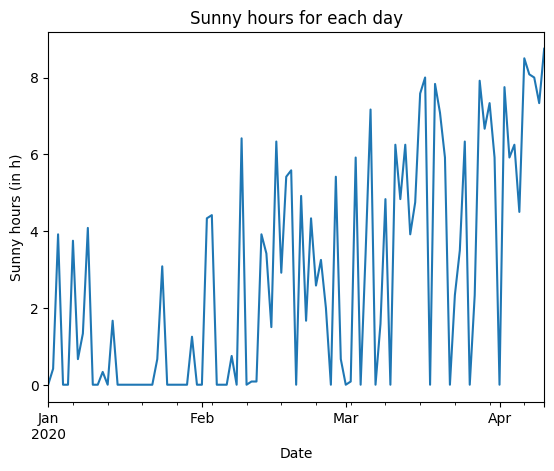

# Calculation of sunny ("nice") days based on small privately owned solar thermal collector systems

[](https://opensource.org/licenses/MIT)
[](https://doi.org/10.5281/zenodo.3751607)

The aim of this project is to use the information extracted from the control units of small privately owned solar thermal collectors to calculate the amount of hours of sunshine a day had.
The goal is to is to allow to extract useful information from otherwise unused data, that can be used to get a much more fine-grained image of weather data.

This repository contains the code to convert the data created by UVR1611 control units and transform it into a table showing the amount of sunny hours for each day.

A detailed overview about the experiment setup can be found [here](docs/overview.pdf).

## Prerequisite
The tool provided in this repository is relying on *Python 3.8*. 

Disclaimer: The commands provided are tested with *Ubuntu 19.10*. If you use another operating systems program paths might be slightly different.

The additional requirements can be easily installed by executing:
```
pip3 install -r requirements.txt
```

## Datasources

The tool requires the output of UVR1611 control units. These are typical control units used in solar thermal collector installations.
These units allow that their sensor data is exported into CSV files. The analysis tool in this repository uses these CSV files to calculate its output.
The exported data should look like this:
```
Datum;Uhrzeit;Sensor1;Sensor2;...
2020-01-01;00:03:30;0.1;40.0
2020-01-01;00:06:30;0.2;39.0
```

## Analysis

To run the analysis run
```
python3 analysis.py <uvr1611-csv-data-file> <column-key> <output-file> <temperatur-threshold> <scan-inverval>
```

## Visualization

The visualization script ```plot.py``` takes the files generated by the analysis script and produces a graph that shows the amount of sunny hours for each day in the dataset.

To visualize the resulting data after the analysis is run, execute:
```
python3 plot.py <output-file> <file1> <file2> ... <file_n>
```

## Testing (docker)

The whole testing procedure that is also provided in the next section is also available as an Dockerfile that creates the graph when the container is built.
To get the output graph file you can execute:
```
docker build -t rodaun-sun-data-builder -f Dockerfile-test .
docker run --rm --entrypoint cat rodaun-sun-data-builder /app/data/rodaun_graph.png > rodaun_graph.png
```

To get the generated data you can start the image with bash to extract them.
```
docker run --rm -it --entrypoint /bin/bash rodaun-sun-data-builder
```

## Testing (non-docker)

For testing this algorithm a small dataset recorded in Vienna is used and can be found also on github.

Link: https://github.com/ralf-saenger/sonnenkollektordaten/tree/2c13133776dec218fcd2d4c7999408d0a293f930

Clone the data into test folder by executing:
```
cd data
git clone https://github.com/ralf-saenger/sonnenkollektordaten
cd sonnenkollektordaten
git checkout 2c13133776dec218fcd2d4c7999408d0a293f930
```

To run the analysis run the following commands in the projects root folder:
```
python3 analysis.py data/sonnenkollektordaten/E2020-01.csv "S1/2 - Solar" data/rodaun_2020_01.csv 50 300
python3 analysis.py data/sonnenkollektordaten/E2020-02.csv "S1/2 - Solar" data/rodaun_2020_02.csv 50 300
python3 analysis.py data/sonnenkollektordaten/E2020-03.csv "S1/2 - Solar" data/rodaun_2020_03.csv 50 300
python3 analysis.py data/sonnenkollektordaten/E2020-04.csv "S1/2 - Solar" data/rodaun_2020_04.csv 50 300
```

The resulting data can be displayed using:
```
python3 plot.py data/rodaun_graph.png data/rodaun_2020_01.csv data/rodaun_2020_02.csv data/rodaun_2020_03.csv data/rodaun_2020_04.csv
```

## Testing Results:

